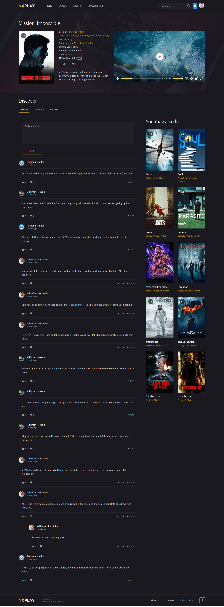

# NXPlay

NXPlay is an open source streaming entertainment service created with Laravel.

> If you like this repo don't forget to give a star! ⭐

### Mobile App Github Repository

[NXPlay Mobile Repository](https://github.com/imamhossain94/nxplay-mobile)

### Installation Instructions

-   Clone the repo.

```shell
    cd nxplay

    composer install

    cp .env.example .env

    php artisan key:generate

    php artisan jwt:secret

    php artisan storage:link
```

-   Edit `.env` file with your `database`, `Pusher` and other credentials.
-   check `.env.example` file for details.

```shell
    php artisan migrate --seed
```

-   If you are using `npm`

```shell
    npm install && npm run dev
```

-   Or if you are using `yarn`

```shell
    yarn install && yarn run dev
```

-   Run the application

```shell
    php artisan serve
```

-   Check [http://localhost:8000/](http://localhost:8000/)

-   Also run these commands in seperate console tab for queues, and schedules to work:

```shell
    php artisan schedule:work

    php artisan queue:work
```

### Screenshots





### Contributing

Thank you for considering contributing to the NXPlay!

### Contribution Guideline

-   Fork the repo.
-   Clone the repo.
-   Run `git checkout dev`
-   Create a new local branch
-   Work on your local branch
-   When work tested, done or ready, push to remote
-   Merge to dev

### License

The NXPlay is open-sourced software licensed under the [MIT license](https://opensource.org/licenses/MIT).
